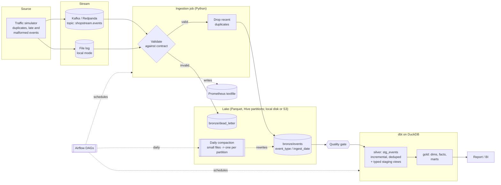

# Architecture

## Data flow

## Layers

| Layer | Location | Contents | Guarantees |
|---|---|---|---|
| Stream | Kafka topic or `data/landing` | Raw JSON messages, keyed by entity (order, customer, session) | Ordered per key; consumers commit explicitly |
| Bronze | `data/lake/bronze/events` or `s3://...` | One row per *validated* message, payload kept as raw JSON, plus `ingested_at`, `batch_id`, `source_position` | Append-only, immutable files, atomic writes |
| Dead letter | `data/lake/bronze/dead_letter` | Every rejected message with the reason | Nothing is silently dropped |
| Silver | `staging.*` | `stg_events` (one row per `event_id`) and one typed view per event type | Unique `event_id`, typed columns |
| Gold | `marts.*` | Dimensions, facts and business marts | Tested keys, reconciled totals, point-in-time correctness; `fct_orders` is incremental and proven equal to a full refresh |

## Delivery semantics and failure modes

The pipeline is **at-least-once end to end, made idempotent at each hop**. The table lists what
happens when something goes wrong, and which test proves it.

| Failure | Behaviour | Covered by |
|---|---|---|
| Producer re-sends an event | Dropped by the in-memory window in ingestion; if it slips past (window too small, restart), `stg_events` de-duplicates on `event_id` | `test_duplicates_are_dropped_and_counted`, end-to-end tests with the window disabled |
| Ingestion crashes after writing bronze, before committing offsets | The batch is replayed; the deterministic batch file name means the same file is overwritten | `test_replaying_a_batch_overwrites_instead_of_duplicating` |
| Bronze write fails (disk full, permissions) | Offsets are not committed, nothing is lost, the job exits non-zero and the orchestrator retries | `test_offsets_are_committed_only_after_the_bronze_write` |
| Malformed or contract-violating message | Routed to the dead-letter dataset with a machine-readable reason; the batch continues | `test_invalid_messages_go_to_the_dead_letter_dataset_with_a_reason` |
| Too many rejects (bad producer deploy) | Quality gate fails; the DAG stops before dbt, so marts keep the last good state | `test_high_reject_ratio_fails_the_gate` |
| Event arrives hours late | Silver loads by *ingestion* time, so it is picked up on the next run; gold recomputes the orders it touches, so the late event lands in the correct historical day | `test_incremental_loads_converge_to_the_same_result` |
| Late payment for an old order | Only that order is recomputed, and the result equals a full refresh | `test_late_payment_for_an_old_order_updates_only_that_order` |
| Late customer update | Every order of that customer is recomputed, because the point-in-time join reads the re-sliced history | `test_late_customer_update_reslices_history_of_existing_orders` |
| Producer rolls out schema v2 while v1 is still in flight | Both validate; a version that does not exist for a type is dead-lettered with a reason | `test_event_types_without_a_v2_reject_version_2`, mixed-version end-to-end run |
| Order loaded before its payment / status events | The order is recomputed when its payment or status event arrives | same test (split lands mid-stream) |
| dbt run interrupted | Incremental model re-reads a 2-hour lookback with `delete+insert` on `event_id`, so a re-run is idempotent | third `dbt build` in the incremental test changes nothing |
| Compaction killed between writing and deleting | Partition briefly holds events twice; the next run merges everything and de-duplicates, silver ignores the duplicates meanwhile | `test_crash_between_write_and_delete_heals_on_the_next_run` |
| Compaction runs while ingestion is writing | Partitions written to within the last hour are skipped | `test_recent_partitions_are_left_alone` |
| Consumer dies after reading but before committing | Kafka redelivers the uncommitted messages; committed ones are never redelivered | `test_uncommitted_messages_are_redelivered_and_committed_ones_are_not` (real Redpanda) |
| Two writers at once | Prevented by orchestration (`max_active_runs=1`); the checkpoint and DuckDB file are single-writer | DAG test |

## Why these tools

DuckDB + Parquet gives a real columnar lakehouse that runs anywhere with no servers to pay for,
so the whole pipeline is reproducible with `make demo`. The modelling code is plain SQL in dbt and
the storage layout is open Parquet; moving to Snowflake, BigQuery or Spark is a change of dbt
adapter and of where the Parquet files live, not a rewrite. See [`docs/adr`](adr).

## What would change at 1000x the volume

* Kafka partitions scale the consumer horizontally; the consumer group is already configured, but
  scaling out a group is not tested yet (see the README roadmap).
* Dimensions and the small marts become incremental too; `fct_orders` already is.
* Orchestration moves from an hourly DAG to event-driven runs triggered by new bronze files.
* DuckDB gives way to a distributed engine or a warehouse; the Parquet layout and the dbt SQL are
  the portable parts.
