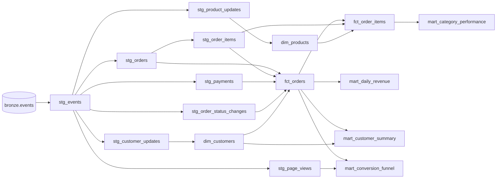

# Data model

## Lineage

## Event contract (v1)

Every message is `{event_id, event_type, schema_version, event_time, payload}`. `event_time` must be
timezone-aware; unknown fields in a payload are rejected. The authoritative definitions are the
Pydantic models in [`src/shopstream/events.py`](../src/shopstream/events.py).

| `event_type` | Payload |
|---|---|
| `customer_updated` | `customer_id, email, country, tier (standard/plus/vip)` |
| `product_upserted` | `product_id, name, category, unit_price, currency` |
| `page_viewed` | `session_id, customer_id?, product_id?, page_type` |
| `order_placed` | `order_id, customer_id, currency, items[{product_id, quantity, unit_price}], discount_amount` |
| `payment_processed` | `payment_id, order_id, amount, method, status (succeeded/failed)` |
| `order_status_changed` | `order_id, status (shipped/delivered/cancelled/refunded)` |

## Gold tables

| Table | Grain | Notes |
|---|---|---|
| `dim_customers` | one row per customer *version* | SCD2. `[valid_from, valid_to)` half-open intervals, `is_current` flag. A row is only created when `country` or `tier` really changes. |
| `dim_products` | one row per product | Type-1 (latest attributes). Order lines keep the price that was charged. |
| `fct_orders` | one row per order | Folds payments and fulfilment into one lifecycle. Joins `dim_customers` **point-in-time**, so `customer_tier_at_order` is the tier the customer had when ordering, not today's. |
| `fct_order_items` | one row per order line | Order discount allocated pro rata, so category revenue reconciles with order revenue. |
| `mart_daily_revenue` | order date | Orders, paid orders, gross, discounts, refunds, net revenue, AOV. |
| `mart_category_performance` | order date x category | Units and recognised net revenue. |
| `mart_conversion_funnel` | session date | Sessions, product/cart/checkout sessions, orders, conversion rates. |
| `mart_customer_summary` | current customer | Lifetime value, recency, and a segment (`prospect`, `one_time`, `repeat`, `high_value`). "Today" is the newest order in the data, so results are reproducible. |

### Business rules

* **Net revenue** of an order is `gross - discount`, recognised once a payment *succeeds*, and
  reversed (moved to `refunded_amount`) when a refund event arrives. Failed payments, abandoned
  orders and cancelled-before-payment orders contribute zero.
* **Order status** is the furthest lifecycle stage reached, with refunds and cancellations taking
  precedence: `refunded > cancelled > delivered > shipped > paid > payment_failed > pending_payment`.
* **Late arrival**: an order is flagged `arrived_late` when it was ingested more than two hours
  after it happened (`late_arrival_threshold_hours`).

## Tests on the model

* 43 dbt data tests: uniqueness, not-null, accepted values, referential integrity (including
  `fct_orders.customer_sk -> dim_customers`, which fails if the point-in-time join drops an order).
* Singular tests for invariants: order totals equal the sum of their lines; SCD2 intervals never
  overlap and each customer has exactly one current row; marts reconcile to the fact table;
  no event is timestamped after its ingestion.
* Outside dbt, [`tests/integration`](../tests/integration/test_end_to_end.py) recomputes revenue
  from the simulator's ground truth and compares it with the warehouse.
